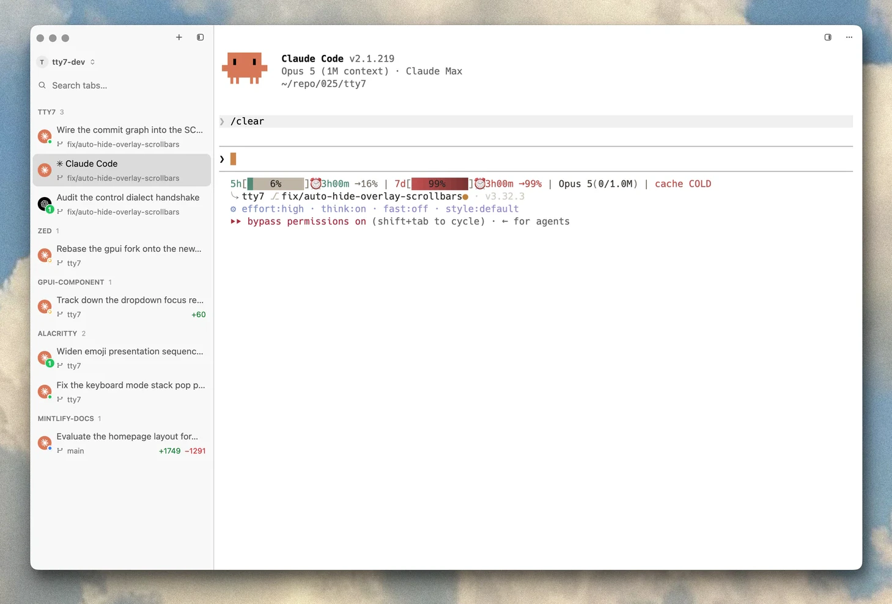

<div align="center">


### nermal

**A terminal workbench with a built-in editor: persistent sessions, remote work, agents.**

<sub>Pure Rust · GPU rendering on Zed's gpui · VT core from Alacritty</sub>

forked from [l0ng-ai/tty7](https://github.com/l0ng-ai/tty7)

<br />

[](https://github.com/l0ng-ai/nermal/actions/workflows/ci.yml)
[](https://github.com/l0ng-ai/nermal/releases)
[](https://github.com/l0ng-ai/nermal/releases)
[](LICENSE)
[](https://discord.gg/s3dethqz2V)

<sub>English · [简体中文](README.zh-CN.md)</sub>

<br />



</div>

## Why

A background server owns your shells and panes — not the window. Everything
below follows from that.

- **Performance** — ~2× the throughput of Alacritty, Ghostty, or Kitty ([benchmarks](#benchmarks))
- **Persistent sessions** — quit or reboot; your shells and supported agent sessions keep running, no tmux
- **Agent-aware** — Claude Code, Codex & co.: status, notifications, and git context for every repo at once
- **Scriptable by agents** — one agent opens a pane for another, hands off a task, waits, and reads the result, with or without the GUI running
- **Editor-grade input** — suggestions, completion, highlighting, history search, with no plugin to install
- **Built-in file editor** — open a file from the tree and it docks beside the terminal, not over it: syntax highlighting for 30+ languages, auto-save, and a conflict banner if something else touches the file first
- **Remote development** — files, repos, panes, and git data stay on the remote machine, over a native SSH stack
- **Git beside the terminal** — source control, diffs, and worktrees without leaving the window

## Install

Native builds for macOS, Windows, and Linux on [**Releases**](https://github.com/l0ng-ai/nermal/releases):

| | | |
|---|---|---|
| **macOS** | `…-macos-arm64.dmg` · `…-x86_64.dmg` | drag into Applications |
| **Windows** | `…-setup.exe` · portable `….zip` | |
| **Linux** | `…-x86_64.AppImage` | `chmod +x` and run — X11/Wayland libraries bundled |

## What's inside

| | |
|---|---|
| **Agent-aware** | per-pane detection (22 CLIs) · status dot · notifications · branch + diff · tray icon when input is needed · resume after reboot · tab sidebar grouped by repository |
| **CLI + Skills** | bundled `nermal` CLI · [agent skill](skills/nermal/SKILL.md) · `run` streams a command and exits with its code · `split` · `send` · `wait --until free` · `capture` |
| **Editor-grade input** | ghost suggestions from history · explained tab completion · syntax highlighting · multi-line editing · click places the caret · <kbd>⌃ R</kbd> fuzzy history |
| **File editor** | file tree docked beside the terminal · tree-sitter highlighting for 30+ languages · auto-save (toggle in the status bar) · reloads on external change, warns on a real conflict · Markdown preview · same editor over SFTP as local |
| **Window** | tabs & splits · <kbd>⌘ P</kbd> palette · <kbd>⌘ F</kbd> scrollback search · <kbd>⌘ J</kbd> panel with process tree and listening ports · 13 themes, your own YAML, iTerm2 import · IME |
| **Shell integration** | injected when a pane starts, nothing to install · prompt marks · working directory · exit codes · command-finished notifications · zsh, bash, fish, PowerShell, WSL, remote panes |
| **Remote workspaces** | remote files, repos, changes, diffs, worktrees, tabs, and panes · reconnect from any client and continue where you left off |
| **SSH** | native russh stack: profiles with keychain secrets · SFTP panel · port forwarding · jump hosts · one-time, unprivileged `nermal-server` install |
| **Git** | panel follows the focused pane · stage, commit, amend, branch, push, stash · side-by-side or unified diffs · commit graph with cherry-pick, revert, and reset · a new worktree opens its own tab |

## Supported agents

**Detection** is free: brand avatar, branch + diff, tab title.
**Status** takes one click under Settings → Agents to install that agent's hook,
and brings the status dot, notifications, the tray icon, `nermal wait`, and resume
after a reboot. **Fork** needs both — the agent's own fork command, and the hook
that tells nermal which session to fork.

<details>
<summary>The full support matrix, all twenty-two</summary>

| Agent | Detected | Status · resume | Fork |
|---|:-:|:-:|:-:|
| **Claude Code** | ✓ | ✓ | ✓ |
| **Codex** | ✓ | ✓ | ✓ |
| **TraeCode** | ✓ | ✓ | ✓ |
| **Grok** | ✓ | ✓ | ✓ |
| **OpenCode** | ✓ | ✓ | ✓ |
| **Oh My Pi** | ✓ | ✓ | ✓ |
| **Droid** | ✓ | ✓ | ✓ |
| **Qwen Code** | ✓ | ✓ | ✓ |
| **Goose** | ✓ | ✓ | ✓ |
| **Qoder CLI** | ✓ | ✓ | ✓ |
| **Gemini** | ✓ | ✓ | |
| **Copilot** | ✓ | ✓ | |
| **Kimi Code** | ✓ | ✓ | |
| **Pi** | ✓ | ✓ | |
| **Crush** | ✓ | ✓ | |
| Aider | ✓ | | |
| Amp | ✓ | | |
| Cursor | ✓ | | |
| Auggie | ✓ | | |
| Hermes | ✓ | | |
| Vibe | ✓ | | |
| Antigravity | ✓ | | |

</details>

None of them are wrapped or proxied — the agent you start is the agent you get,
in a normal PTY, with its own interface. An agent launched through a wrapper
script can be mapped to one by name with `agent_commands` in `config.json`.

## Documentation

Full documentation lives in [**`docs/`**](docs/) —
[keyboard shortcuts](docs/reference/keyboard-shortcuts.mdx) ·
[config.json](docs/reference/configuration.mdx) ·
[CLI reference](docs/cli/reference.mdx). The agent-facing CLI interface is also
documented in [skills/nermal/SKILL.md](skills/nermal/SKILL.md).

Install the skill with:

```sh
npx skills add l0ng-ai/nermal    # install
npx skills update nermal         # update later
```

## Benchmarks

Same machine, same day, same 155×40 grid — Apple M1 Pro, macOS 26.3.1,
five-run averages (2026-07-04):

| | **nermal** | Alacritty | Ghostty | Kitty |
|---|---:|---:|---:|---:|
| Plaintext I/O — 11 MB `cat` <sub>(lower = better)</sub> | **95 ms** | 239 ms | 179 ms | 185 ms |
| [DOOM-fire](https://github.com/const-void/DOOM-fire-zig) frame rate <sub>(higher = better)</sub> | **888 fps** | 485 fps | 552 fps | 617 fps |
| Cold-launch memory | 116 MB¹ | 105 MB | 128 MB | 130 MB |

<sub>¹ GUI 105 MB + the persistent server 11 MB.</sub>

Methodology and one-command reproduction: [`scripts/bench/`](scripts/bench/README.md).

---

<div align="center">
<sub>

Built on [gpui](https://github.com/zed-industries/zed) and [`alacritty_terminal`](https://github.com/zed-industries/alacritty) · [Apache-2.0](LICENSE) · [Discord](https://discord.gg/s3dethqz2V) · [Changelog](CHANGELOG.md)

</sub>
</div>

test
